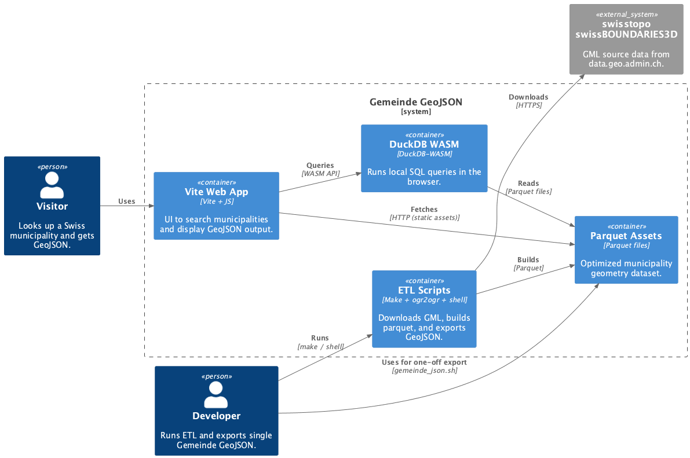
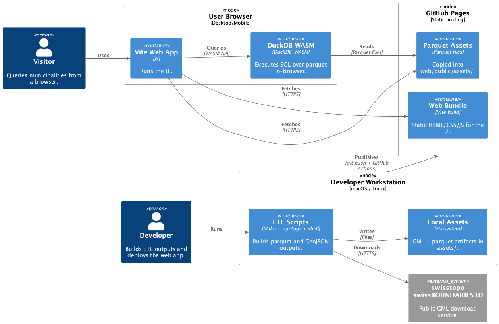

# Gemeinde GeoJSON

[GitHub Pages](https://ping13.github.io/ch-gemeinde-geojson/)

Small DuckDB-WASM + Parquet demo that extracts Swiss municipality geometries.
Type a Swiss community name and get the GeoJSON back from swissBOUNDARIES3D in
a simple Vite UI. The GeoJSON output can be pasted into
https://designer.topoprint.ch/pro.html for map layouts.

Data source: swissBOUNDARIES3D (swisstopo).

## Project Structure
- `Makefile` handles ETL steps and web tasks.
- `assets/` stores source GML/ZIP and generated parquet files.
- `web/` is the Vite frontend (`web/src/`, `web/public/`).

## Architecture Diagrams
The architecture centers on a small ETL workflow that downloads swisstopo GML,
converts it into optimized parquet assets, and serves those assets to a Vite
web app. In the browser, DuckDB-WASM queries the parquet files locally so users
can retrieve GeoJSON by municipality name without a backend service.



Deployment-wise, the ETL runs on a developer workstation, parquet assets are
copied into the web bundle, and the static site is deployed to GitHub Pages.
Users load the app in their browser and query the parquet assets client-side.



## Quick Start
```sh
make parquet
make bun-install
make bun-dev
```

## Common Commands
- `make download` fetch the source GML ZIP.
- `make extract` unzip and record the GML path.
- `make parquet` build the optimized parquet and copy it to `web/public/assets/`.
- `make bun-build` build the production bundle.
- `make bun-preview` preview the production build.

## Gemeinde GeoJSON Export
Use `gemeinde_json.sh` to export a single municipality GeoJSON from the parquet.
The default `make gemeinde-geojson` uses `GEMEINDE_NAME=Zürich`.
```sh
make gemeinde-geojson
make gemeinde-geojson GEMEINDE_NAME="Zürich"
make gemeinde-geojson GEMEINDE_NAME="Zürich" OUT=zurich.geojson
```
